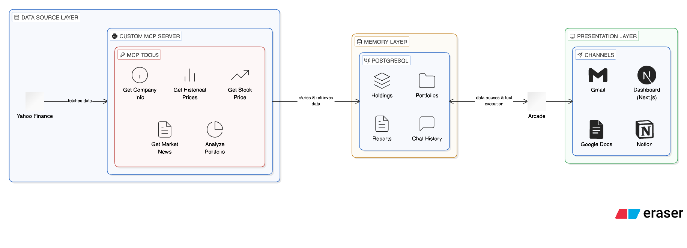

# CPMarshal - AI-Powered Portfolio Intelligence

An intelligent financial agent that analyzes your investment portfolio, fetches real-time market data, and delivers personalized insights through multiple channels—all powered by [Arcade](https://arcade.dev).

## Overview

CPMarshal demonstrates how to build a production-ready AI agent using a **three-layer architecture** that separates concerns between data sourcing, persistent memory, and multi-channel presentation. The application showcases Arcade's seamless OAuth handling for Gmail, Notion, and Google Docs integration.

### What It Does

- **Tracks Your Portfolio**: Manage multiple investment portfolios with holdings, purchase prices, and quantities
- **Fetches Real-Time Data**: Custom MCP server retrieves live stock prices, company fundamentals, and market news
- **Generates AI Reports**: LLM-powered analysis that synthesizes market data into actionable insights
- **Delivers Anywhere**: Publish reports to Gmail, Notion, or Google Docs with one-click OAuth
- **Scheduled Automation**: Weekly cron jobs automatically generate and email portfolio reports
- **Interactive Chat**: Ask questions about your portfolio and get AI-powered responses in real-time

## Architecture



### Layer Breakdown

| Layer | Purpose | Technology |
|-------|---------|------------|
| **Data Source** | Fetches real-time financial data | Custom MCP Server (Python + arcade-mcp) |
| **Memory** | Persists portfolios, reports, and chat history | PostgreSQL with Prisma ORM |
| **Presentation** | Delivers insights through multiple channels | Next.js Dashboard, Gmail, Notion, Google Docs |

## Arcade Integration

Arcade is the backbone that enables seamless multi-channel publishing without the complexity of managing OAuth flows manually.

### How Arcade Powers This Application

#### 1. Tool Execution via Arcade SDK

```typescript
import Arcade from "@arcadeai/arcadejs";

const arcadeClient = new Arcade({ apiKey: process.env.ARCADE_API_KEY });

// Execute any tool with automatic auth handling
const response = await arcadeClient.tools.execute({
  tool_name: "Gmail.SendEmail",
  input: {
    subject: "Weekly Portfolio Report",
    body: reportHtml,
    recipient: userEmail,
    content_type: "html",
  },
  user_id: userId,
});
```

#### 2. OAuth Authorization Flow

```typescript
// Check if user has authorized Gmail
const authResponse = await arcadeClient.tools.authorize({
  tool_name: "Gmail.SendEmail",
  user_id: userId,
});

if (authResponse.status === "pending") {
  // Redirect user to Arcade's OAuth consent screen
  return { authorizationUrl: authResponse.authorization_url };
}

// User is authorized, proceed with tool execution
```

#### 3. Supported Integrations

| Tool | Arcade Tool Name | Use Case |
|------|------------------|----------|
| **Gmail** | `Gmail.SendEmail` | Send portfolio reports via email |
| **Notion** | `Notion.CreatePage` | Export reports as Notion pages |
| **Google Docs** | `GoogleDocs.CreateDocumentFromText` | Create formatted report documents |

### Why Arcade?

- **Zero OAuth Complexity**: No need to register apps with Google/Notion, manage client secrets, or handle token refresh
- **Unified API**: Same pattern for Gmail, Notion, Google Docs, and 100+ other integrations
- **User-Scoped Auth**: Each user authorizes once, Arcade handles the rest
- **Production Ready**: Built for scale with automatic token management

## Custom MCP Server

The application includes a custom MCP (Model Context Protocol) server built with `arcade-mcp` that provides financial data tools.

### Available Tools

| Tool | Description |
|------|-------------|
| `get_stock_price` | Fetch current price, volume, and daily change for a ticker |
| `get_company_info` | Retrieve company fundamentals (market cap, P/E, sector, etc.) |
| `get_historical_prices` | Get historical OHLCV data for trend analysis |
| `get_market_news` | Fetch latest news articles for a stock |
| `analyze_portfolio` | Comprehensive analysis of multiple holdings at once |

### MCP Server Structure

```
mcp-server/
├── src/
│   └── financial_mcp/
│       ├── server.py              # Main MCP app entrypoint
│       ├── tools/
│       │   ├── stock_data.py      # Price and historical data
│       │   ├── company_info.py    # Company fundamentals
│       │   ├── market_news.py     # News aggregation
│       │   └── portfolio_analysis.py  # Multi-stock analysis
│       └── utils/
│           └── yfinance_client.py # Yahoo Finance wrapper
└── pyproject.toml
```

### Deploying to Arcade

```bash
cd mcp-server
arcade deploy
```

Once deployed, the MCP server is accessible through Arcade's tool execution API, enabling the AI chat and report generation features.

## Features

### Portfolio Management
- Create and manage multiple portfolios
- Add holdings with ticker, quantity, and purchase price
- Real-time valuation with live market data
- Performance tracking with gain/loss calculations

### AI-Powered Reports
- One-click report generation for any portfolio
- LLM synthesizes market data into actionable insights
- Streaming report generation with real-time updates
- Publish to Dashboard, Gmail, Notion, or Google Docs

### Interactive AI Chat
- Natural language interface to query your portfolio
- Real-time tool calling to fetch market data
- Persistent chat history across sessions
- Context-aware responses about your holdings

### Scheduled Reports
- Automated weekly portfolio reports via Vercel Cron
- Emails delivered directly to your inbox
- Configurable output channels per portfolio

## Tech Stack

| Category | Technology |
|----------|------------|
| **Framework** | Next.js 16 (App Router) |
| **Language** | TypeScript |
| **Database** | PostgreSQL + Prisma ORM |
| **Authentication** | Better Auth |
| **AI/LLM** | Vercel AI SDK |
| **Tool Execution** | Arcade SDK (`@arcadeai/arcadejs`) |
| **MCP Server** | Python + arcade-mcp |
| **Styling** | Tailwind CSS v4 + shadcn/ui |
| **API Layer** | oRPC (type-safe RPC) |
| **Charts** | Recharts |
| **Animations** | Motion (Framer Motion) |
| **Deployment** | Vercel |

## Project Structure

```
├── app/
│   ├── api/
│   │   ├── ai-chat/          # AI chat streaming endpoint
│   │   └── cron/             # Vercel cron job handlers
│   ├── auth/                 # Authentication pages
│   └── dashboard/
│       ├── ai-chat/          # Interactive chat interface
│       ├── portfolio/        # Portfolio management
│       └── reports/          # Report generation & viewing
├── components/
│   ├── ui/                   # shadcn/ui components
│   └── ...                   # App components
├── lib/
│   ├── arcade.ts             # Arcade client configuration
│   ├── auth.ts               # Better Auth setup
│   └── prisma.ts             # Database client
├── mcp-server/               # Custom MCP server (Python)
└── prisma/
    └── schema.prisma         # Database schema
```

## Getting Started

### Prerequisites

- Node.js 18+
- Python 3.10+
- PostgreSQL database
- Arcade API key ([Get one here](https://arcade.dev))

### Installation

1. **Clone the repository**
   ```bash
   git clone <repository-url>
   cd mcp-project
   ```

2. **Install Node dependencies**
   ```bash
   npm install
   ```

3. **Set up environment variables**
   ```bash
   cp .env.example .env
   ```

   Configure the following variables:
   ```env
   # Database
   DATABASE_URL="postgresql://..."

   # Authentication
   BETTER_AUTH_SECRET="your-secret-key"
   BETTER_AUTH_URL="http://localhost:3000"

   # Arcade
   ARCADE_API_KEY="your-arcade-api-key"

   # AI
   ANTHROPIC_API_KEY="your-anthropic-key"
   ```

4. **Initialize the database**
   ```bash
   npx prisma db push
   ```

5. **Deploy the MCP server to Arcade**
   ```bash
   cd mcp-server
   pip install -e .
   arcade deploy
   ```

6. **Start the development server**
   ```bash
   npm run dev
   ```

7. **Open the application**

   Navigate to [http://localhost:3000](http://localhost:3000)

## Environment Variables

| Variable | Description | Required |
|----------|-------------|----------|
| `DATABASE_URL` | PostgreSQL connection string | Yes |
| `BETTER_AUTH_SECRET` | Secret key for session encryption | Yes |
| `BETTER_AUTH_URL` | Base URL of the application | Yes |
| `ARCADE_API_KEY` | Arcade API key for tool execution | Yes |
| `ANTHROPIC_API_KEY` | Anthropic API key for LLM features | Yes |

## Deployment

### Vercel (Recommended)

1. Push your code to GitHub
2. Import the project in Vercel
3. Configure environment variables
4. Deploy

The application includes a `vercel.json` with cron job configuration for weekly reports:

```json
{
  "crons": [
    {
      "path": "/api/cron/weekly-reports",
      "schedule": "0 9 * * 1"
    }
  ]
}
```

### MCP Server

Deploy the MCP server to Arcade:

```bash
cd mcp-server
arcade deploy
```

## Demo Walkthrough

1. **Create an Account**: Sign up with email/password
2. **Add a Portfolio**: Create a portfolio and add your holdings
3. **Generate a Report**: Click "Generate Report" to create an AI analysis
4. **Publish to Gmail**: Click "Publish" and authorize Gmail through Arcade
5. **Chat with AI**: Ask questions about your portfolio in the AI Chat
6. **Automatic Reports**: Enable scheduled reports to receive weekly emails

## License

MIT

---

Built with [Arcade](https://arcade.dev) | [Next.js](https://nextjs.org) | [Vercel AI SDK](https://sdk.vercel.ai)
